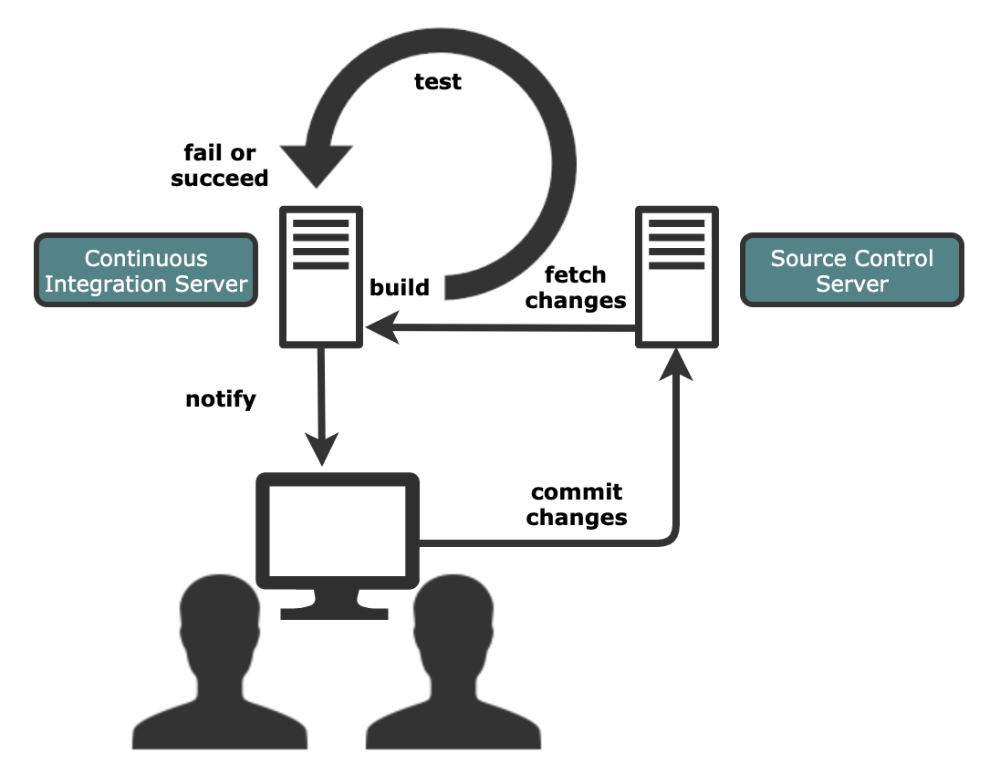
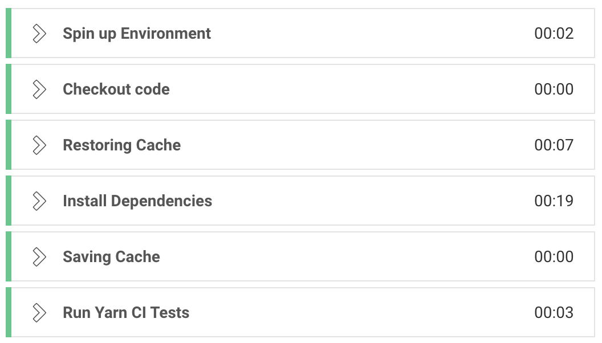
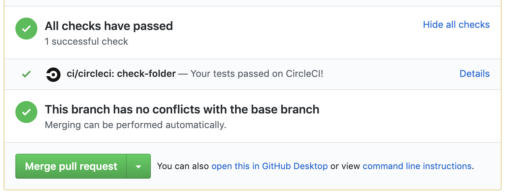

Over the last week, myself and my fellow apprentices at Codurance have been working on delivering a product as part of our final project. To do this we have been applying Agile methodologies, specifically [Scrum processeses](https://scrumguides.org/) and [XP practices](http://www.extremeprogramming.org/). 

One of the key practices of XP is developers continuously integrating new code to the code repository (for us that was [GitHub](https://github.com/)). We decided that we would use short-lived feature branches (less than a day), code reviews and a merge when green policy as part of this process. This meant our pipeline needed to both build our apps and run the tests for each branch that was intended to be merged via a [PR](https://help.github.com/en/articles/about-pull-requests).

As a team we decided upon the following pipeline:

* CircleCI to manage the pipeline 
* Docker Hub to host the images 
* Terraform to manage the deployment
* AWS as the cloud provider

In this post, I'm only going to cover the first two bullet points which is the continuous integration part of the pipeline. I'll talk about the deployment, or delivery, in a separate write-up.

#### Continuous Integration
So what is continuous integration (CI) and why is it an important part of extreme programming? CI is, for me, an essential part of a tight feedback loop with the codebase, between its current state and it's future state based on proposed changes. Its aim is to find and address bugs and/or breaking changes, improve software quality and increase the velocity of releases. 

With CI, developers will frequently commit to a central repository using version control, commonly git. Developers will often run tests locally (unit tests, and maybe some lightweight integration tests) before pushing their code. A CI service will then automatically build and run the tests on the code changes in a production-like environment to immediately raise any errors. If there are any to be found the build will fail and the code changes will not be introduced to master, or the trunk branch.

**<center>Continuous Integration Flow:</center>**



For us, as a team, implementing CI early in our development lifecycle allowed us to get quick feedback on intended changes and to avoid divergent, unmergable or broken code being introduced.

We decided upon CircleCI as it has an easy to use GUI and integrates incredibly easily with Github. It's as easy as:

```
1. Signing-up with CircleCI and selecting your preferred repository.
2. Add the project that you'd like to manage.
3. Add a .circleci folder at the top of your project’s master branch.
4. Add a config.yml file inside the .circleci folder.
```

Simples. This file is picked up by CircleCI and then the defined jobs and workflows are applied. Below is an example config file for building and testing a simple Node.js express app, including using a cache to save time on rebuilds:

```yaml
version: 2
jobs:
  build:
    docker:
      # specify the same version of your environment in production:
      - image: circleci/node:10.16.3
    working_directory: ~/project
    steps:
      - checkout
      - restore_cache:
          keys:
            - node-dependencies-{{ checksum "yarn.lock" }}
      - run: 
          name: Install Dependencies
          command: yarn
      - save_cache:
          paths:
            - node_modules
          key: node-dependencies-{{ checksum "yarn.lock" }}
  test:
    docker:
      - image: circleci/node:10.16.3
      - run:
          name: Run Tests
          command: yarn test

workflows:
  version: 2
  build_and_test:
    jobs:
      - build
      - test:
          requires:
            - build
```
So let's break this down into each section:

#### Jobs

* `version`: The target version of CircleCI.
* `jobs`: Where the jobs that are to be scheduled are defined.
* `build`/`test`: The name of our jobs to be defined. These are then referred to in the `workflows` section.
* `docker` : The instance of the environment where the commands will be run
* `working-directory` : The directory where the commands will run. Default is `~/project`, shown here as an example. 
* `steps` : These steps will run in sequence for the defined job.
* `checkout` : Fetches the source code from the repo. By default, source code is checked out to the path specified by `working_directory`
* `restore-cache` : This will check the file defined in the key for any changes and skip the following step if none are found.
* `run` : Will run the command with `name` giving a description of the command (this becomes the title in CircleCI) and `command` being the command to be run.
* `save-cache` : This will save the folder defined in the `paths` field after running the previous command. This will then be the artifact checked in `restore-cache` on the next build.

#### Workflows

* `workflows` : This describes the flow of the jobs that have been defined in the `jobs` section.
* `build_and_test` : The name of our workflow.
* `jobs` : The name of the jobs to be run.
* `requires` : This allows us to ensure the `build` job is completed before the `test` job is triggered. Otherwise, they would run in parallel 

An example of how this may look in your jobs output in CircleCI. You can view this by clicking on a specific job under 'Jobs -> account -> project'.

**<center>CircleCI Jobs</center>**



As an aside, if you are running your application in docker, your config.yaml may look similar to the following which first builds the docker image then runs the app and initiates the tests inside the container using the `setup_remote_docker` step. For more info please read [the CircleCI documentation for running Docker Commands](https://circleci.com/docs/2.0/building-docker-images/):

```yaml
version: 2
jobs:
  build:
    docker:
      - image: circleci/node:10.16.3
    working_directory: ~/project
    steps:
      - setup_remote_docker
      - checkout
      - run: 
          name: Build Docker Image
          command: docker build -t crafter-coder/example-app:latest .
  test:
    docker:
      - image: circleci/node:10.16.3
      - run:
          name: Run Tests
          command: docker run crafter-coder/example-app:latest yarn test

workflows:
  version: 2
  build_and_test:
    jobs:
      - build
      - test:
          requires:
            - build
```

**<center>This is how your PRs may look on GitHub:</center>**



There are some downsides to using CircleCI, most notably that it does not offer docker layer caching on the free tier. This would certainly speed up build time as layers would only need to be rebuilt if any changes had been made. Similar to multi-stage Dockerfiles being built locally on your machine. If you have a premium account (lucky you!) then you need only add `docker_layer_caching: true` under `setup_remote_docker` to utilse this.

Another thing is the fact that we decided to use a monorepo that housed both our web API and our web app projects. There isn't support out the box for monorepos in CircleCI but there is a way, using a custom shell script. Due to the added complexity this brings it doesn't belong in this introduction but I may make a post about that also. It calls the CircleCI API but the features are only in beta and so may change. We decided not to use it in the end and simply deploy both apps each time. This would not be ideal on a large scale but for our purposes it works fine. 

Finally, as mentioned earlier in this post, I have only covered the build and test stages as these pertain to CI and not necessarily CD (continuous delivery/deployment). I'll cover this in a subsequent post soon.

TIll then. 

Thanks for reading!