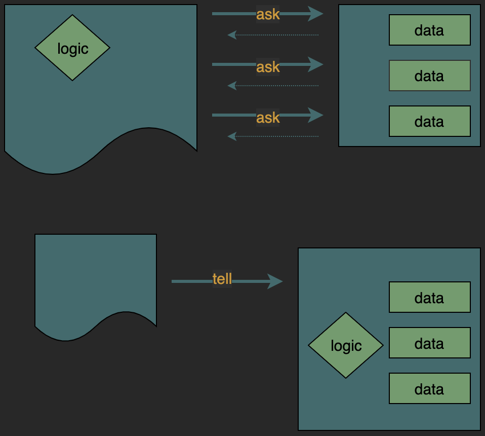

During my time as an apprentice at Codurance I've come across the software design principle of 'Tell, don't ask'. I believe it's something that my budding code smell radar was already aware of but only now do I feel able to explain it.

Put as simply as possible, the object-oriented paradigm promotes the idea that we, as programmers, create code that tells objects to do stuff. We should endevour to tell objects what we want them to do and let them get on with it. What we should NOT do is ask them for some internal state and make decisions on their behalf.

We want to avoid our code becoming highly coupled to the internal workings of an object and keep a high level of cohesion within that object. If we encapsulate all the logic for the behaviour we expect from an object in the object itself we can then abstract this away from our code making it more robust. This means that if (or more likely when) we need to modify existing or add new logic (read behaviour) then we only need to change the code in the logical place (the object) or extend the object using an abstract class or an interface.

The below diagram (shamelessly copied from [this blog post](https://martinfowler.com/bliki/TellDontAsk.html) by Martin Fowler) helps visualize what the difference I'm trying to explain is:



Let's look at a simple example in Java:

#### Ask
```Java
public void makeAnimalEat(Animal animal) {
    if (animal.isHungry()) {
        animal.eat()
    } else {
        // do nothing
    }
}

public class Animal {
    public void eat() {
        //eat
    }

    public bool isHungry() {
        //code
    }
}
```

#### Tell

```Java
public void makeAnimalEat(Animal animal) {
    animal.eat()
}

public class Animal {
    public void eat() {
        if (isHungry()) {
            //eat
        }
    }

    private bool isHungry() {
        //code
    }
}
```

This simple example may have you saying "Sure, that's obvious, I’d never write code like this". However, as simplistic as this code may be it’s surprisingly easy to fall into the pattern of querying an object and then calling different methods based on the results. I've certainly done it. Now I'm beginning to understand that this, in many situations, may not be the best way to go about it. In object-oriented code, it's important to think declaratively instead of procedurally!

Avoiding this trap is easier if you write your code by first designing classes based on their responsibilities. It's even easier when you apply TDD from the [outside in](https://www.codecademy.com/articles/tdd-outside-in) with collaborators and mocks!<sup>*</sup> This way you can think about what commands you may want to **tell** the object to do rather than **ask** the object about it's internal state.

Now, I may face a situation in the future where this principle doesn't apply. The measure of how well you understand software design principles is, in my mind, knowing when to ignore or outright defy them. 

I can imagine, using our example, that we may have external factors outside the animal that influence whether it should eat or not. In this situation we may not want to move that specific logic into the animal. It's likely it belongs in a different abstraction. If I come across a situation like this I'll be sure to write about it here.

#### TLDR
* Tell objects what we want them to do and leave them to it
* Don't ask for internal state and make decisions on their behalf
* Be declarative not procedural

<sup>* </sup>More on outside in TDD another time.