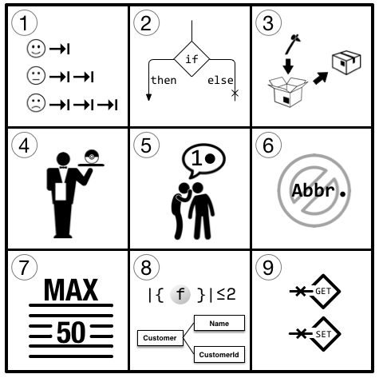

Following on from last weeks post about the [Transformation Priority Premise](http://localhost:8000/blog/transformation-priority-premise) this post is about another constraint that we used whilst learning Test Driven Development at [Codurance](https://codurance.com). 



Originally proposed by Jeff Bay in the [ThoughtWorks Anthology](https://pragprog.com/book/twa/thoughtworks-anthology) (which is unfortunately out of print) __Object Calisthenics__ are a set of rules, or constraints, to follow whilst test driving a solution to the programming problem of your choice.

These rules are:
```
1.  Use only one level of indentation per method.
2.  Don’t use the else keyword.
3.  Wrap all primitives and strings.
4.  Use only one dot per line.
5.  Don’t abbreviate.
6.  Keep all entities small.
7.  Don’t use any classes with more than two instance variables.
8.  Use first-class collections.
9.  Don’t use any getters/setters/properties.
```
If applied, these rules force you, sometimes without even realising, to implement and apply [SOLID](https://en.wikipedia.org/wiki/SOLID) design principles, [Design Patterns](https://en.wikipedia.org/wiki/Software_design_pattern) and improve __code quality__ in your software projects. 

At first glance, some of these rules seem very simple, whereas others may require you to really think hard before beginning your Red-Green-Refactor cycle.

Let's go through the rules one by one and break down what I believe each one is trying to enforce and what practice it's trying to instill.

#### Rule 1: Use only one level of indentation per method.

Code that has many lines of indentation is hard to read, even harder to maintain and even harder still to adapt to change. For example:

```java
class World {
    public int[] initializeMap () {
        int[] map;
        for (int i = 0; i < 10; i++) {
            for (int j = 0; j < 10; j++) {
                map[i][j] = 0;
            }
        }

        return map
    }
}
```

To adhere to this rule, you will have to split your methods up during the refactoring stage. The [Extract Method](https://refactoring.guru/extract-method) pattern will help you do this. Make sure to use explanatory method names to help with readability. Such as:

```java
class World {
    public int[] initializeMap () {
        int[] map;
        createRows(map);

        return map;
    }

    private void createRows(int[] map) {
        for (int i = 0; i < 10; i++) {
            createRow(map, i);
        }
    }

    private void createRow(int[] map, int row) {
        for (int i = 0; i < 10; i++) {
            map[row][i]);
        }
    }
}
```
This constraint is not about reducing the number of lines of code but rather increasing the readability in a significant way.

#### Rule 2: Don’t use the else keyword.

This one is applied across the board at Codurance and so came quite naturally after a couple of weeks coding here. `else`'s by their very nature lead to additional branches of code that nest and nest until before you know it you've created the next [Gilded Rose](https://github.com/emilybache/GildedRose-Refactoring-Kata) (which is an excellent refactoring kata by the way). 

For example:


```java
public void login(String username, String password) {
    if (userRepository.isValid(username, password)) {
        redirect("homepage");
    } else {
        addFlash("error", "Bad credentials");

        redirect("login");
    }
}
```

The solution to this can be to simpley use an early return like so:

```java
public void login(String username, String password) {
    if (userRepository.isValid(username, password)) {
        return redirect("homepage");
    }

    addFlash("error", "Bad credentials");

    return redirect("login");
}
```

Alternatively you can makes use of the features of Object Oriented programming and implement polymorphism, introduce the [Null Object](https://refactoring.guru/introduce-null-object), or apply the [State](https://refactoring.guru/design-patterns/state) or [Strategy](https://refactoring.guru/design-patterns/strategy) patterns here as well.

#### Rule 3: Wrap all primitives and strings.

This rule seems aimed at avoiding [Primitive Obsession](https://refactoring.guru/smells/primitive-obsession), a common code smell. As explained by the excellent [refactoring.guru](https://refactoring.guru/):

>> _"Like most other smells, primitive obsessions are born in moments of weakness. “Just a field for storing some data!” the programmer said. Creating a primitive field is so much easier than making a whole new class, right? And so it was done. Then another field was needed and added in the same way. Lo and behold, the class became huge and unwieldy._

The recommended remedy to this code smell is actually to apply this rule. Use small objects to encapsulate the data being held in the primitive types. Even better, try moving the behaviour associated with this data to the object as well. This will help your code be more understandable and better organized. Operations on particular data are in the same place improving maintainability and reduce the cost of future change.

For example, in Java, use `Money` instead of a `double` for currency, or `Hour` instead of `LocalDate` for time.

#### Rule 4: Use only one dot per line.

This rule is reflecting the [Law of Demeter](https://en.wikipedia.org/wiki/Law_of_Demeter) which can be succinctly summarized as: 

>>  _"Each unit should only talk to its friends; don't talk to strangers"._

Or put another way, an object should not be reaching through another instance of an object to talk to yet another object. __Use only one dot per line__.


#### Rule 5: Don't abbreviate.

This rule just makes good sense for most (I'd argue all) object oriented languages. It makes your code more readable and therefore easier to maintain.

I'd question any reason I was given to accept abbreviated variable or method names. If you say you're sick of writing the same variable name over and over, I'd say you probably have some duplication to remove. If it's too long, say for a method name, then maybe it's trying to do too much! If you're struggling with naming then maybe there's more going on that is causing problems, take a step back and see if you can refactor away the need for that name.

#### Rule 6: Keep all entities small.
#### Rule 7: Don't use any classes with more than two instance variables.

Rule 6 and 7 force you to apply one of the [4 Rules of Simple Design](https://martinfowler.com/bliki/BeckDesignRules.html), "fewest elements" or as [Corey Haines](https://www.goodreads.com/book/show/21841698-understanding-the-four-rules-of-simple-design) puts it "keep it small". They aim to promote high cohesion and better encapsulation.

It is recommended to restrict your code to having no class over 50 lines and no package over 10 files. I think we also added no method with more than 5 lines just to make it extra strict!

#### Rule 8: Use first-class collections.

If you have class that contains a collection then it should not contain other instance variables. If you have a set of elements and want to manipulate them, create a class that is dedicated for this set.

Therefore each collection gets wrapped in its own class, such that any necessary behaviors related to the collection have a home (applying a rule to each element, filtering, adding to the set, etc).

#### Rule 9: Don’t use any getters/setters/properties.

This rule could be rephrased as ["tell, don't ask"](https://martinfowler.com/bliki/TellDontAsk.html). Here's an example from Martin Fowler himself (with a small change to reflect the rule):

```java
class AskMonitor...

  private int value;
  private int limit;
  private boolean isTooHigh;
  private String name;
  private Alarm alarm;

  public AskMonitor (String name, int limit, Alarm alarm) {
    this.name = name;
    this.limit = limit;
    this.alarm = alarm;
  }
```
...and combine this with some accessors to get at this data

```java
class AskMonitor...

  public int getValue() {return value;}
  public void setValue(int arg) {value = arg;}
  public int getLimit() {return limit;}
  public String getName()  {return name;}
  public Alarm getAlarm() {return alarm;}
```
We would then use the data structure like this:

```java
AskMonitor am = new AskMonitor("Time Vortex Hocus", 2, alarm);
am.setValue(3);
if (am.getValue() > am.getLimit()) 
  am.getAlarm().warn(am.getName() + " too high");
```

"Tell Don't Ask" reminds us to instead put the behavior inside the monitor object itself (using the same fields).

```java
class TellMonitor...

  public void updateValue(int arg) {
    value = arg;
    if (value > limit) alarm.warn(name + " too high");
  }
```
Which would be used like this:

```java
TellMonitor tm = new TellMonitor("Time Vortex Hocus", 2, alarm);
tm.updateValue(3);
```

Ultimatley it's about moving the behavior of an object to where it's data is encapsualted. This is one of the fundamental principles of object-oriented design. This rule is trying to get you to think about moving the coupling of data and the behaviour that manipulates it into the same component (read class). This is a good thing, however, be aware that this is not always a rule to follow outside of Object Calisthenics. Don't fail into the trap of becoming a [Getter Eradicator](https://martinfowler.com/bliki/GetterEradicator.html)!

#### In Conclusion

I really enjoyed the process of completing a kata, we did the awesome Mars Rover kata, first without applying these rules and then again then next day applying Object Calisthenics strictly. As the code evolved I found myself understanding the smells and design patterns better through direct practice. I highly recommend trying them out on your next kata, or even better, production code! It will be interesting as I continue on my journey during the apprenticeship to understand when, and how to best adhere to the rules, and when it's a good time to break them!

_After completing this blog post I found Jeff Bays original paper on [Object Calisthenics](https://www.cs.helsinki.fi/u/luontola/tdd-2009/ext/ObjectCalisthenics.pdf). It certainly would have been helpful in the creation of this post and I share it here so that you can read it from the horse's mouth as it were and not have to rely on my patchy explanations!_